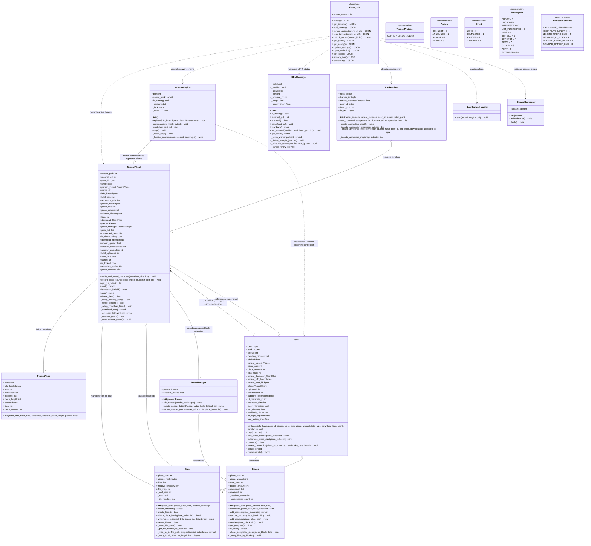

# UML Class Diagram

This diagram represents the actual class structure and relationships of the **iTorrent** BitTorrent engine.

```mermaid
%%{init: {
  "theme": "default",
  "themeCSS": ".relation { stroke-width: 3px !important; } .relation-line { stroke-width: 3px !important; } .edgePath .path { stroke-width: 3px !important; } .edgePath path { stroke-width: 3px !important; } .classGroup line { stroke-width: 3px !important; } g.edgePaths path { stroke-width: 3px !important; }"
}}%%
classDiagram
    %% Core Classes

    class TorrentClass {
        + name: str
        + info_hash: bytes
        + size: int
        + announce: str
        + trackers: list
        + piece_length: int
        + pieces: bytes
        + files: list
        + piece_amount: int
        + __init__(name, info_hash, size, announce, trackers, piece_length, pieces, files)
    }

    class TorrentClient {
        + torrent_path: str
        + magnet_url: str
        + peer_id: bytes
        + Error: bool
        + parsed_torrent: TorrentClass
        + name: str
        + info_hash: bytes
        + total_size: int
        + announce_urls: list
        + pieces_hash: bytes
        + piece_size: int
        + piece_amount: int
        + relative_directory: str
        + files: list
        + download_files: Files
        + pieces: Pieces
        + piece_manager: PieceManager
        + peer_list: list
        + connected_peers: list
        + is_downloading: bool
        + download_speed: float
        + upload_speed: float
        + session_downloaded: int
        + session_uploaded: int
        + total_uploaded: int
        + start_time: float
        + status: str
        + is_locked: bool
        + metadata_buffer: dict
        + piece_sources: dict
        + verify_and_install_metadata(metadata_size: int): void
        + record_piece_source(piece_index: int, ip: str, port: int): void
        + get_gui_data(): dict
        + start(): void
        + broadcast_bitfield(): void
        + stop(): void
        + delete_files(): bool
        - _verify_existing_files(): void
        - _setup_pieces(): bool
        - _setup_download_files(): void
        - _download_loop(): void
        - _get_peer_list(event: int): void
        - _connect_peers(): void
        - _communicate_peers(): void
    }

    class Files {
        + piece_size: int
        + pieces_hash: bytes
        + files: list
        + relative_directory: str
        + file_map: list
        - _total_size: int
        - _lock: Lock
        - _file_handles: dict
        + __init__(piece_size, pieces_hash, files, relative_directory)
        + create_directory(): bool
        + create_files(): bool
        + check_piece_hash(piece_index: int): bool
        + write(piece_index: int, byte_index: int, data: bytes): void
        + delete_files(): bool
        - _setup_file_map(): void
        - _get_file_handle(file_path: str): file
        - _write_to_file(file_path: str, position: int, data: bytes): void
        - _read(global_offset: int, length: int): bytes
    }

    class Pieces {
        + piece_size: int
        + piece_amount: int
        + total_size: int
        + blocks_amount: int
        + requested: list
        + received: list
        - _received_count: int
        - _unrequested_count: int
        + __init__(piece_size, piece_amount, total_size)
        + determine_piece_size(piece_index: int): int
        + add_request(piece_block: dict): void
        + remove_request(piece_block: dict): void
        + add_received(piece_block: dict): void
        + needed(piece_block: dict): bool
        + get_progress(): float
        + is_done(): bool
        + check_completed_piece(piece_block: dict): bool
        - _setup_lists_by_blocks(): void
    }

    class PieceManager {
        + pieces: Pieces
        + seeders_pieces: dict
        + __init__(pieces: Pieces)
        + add_seeder(seeder_addr: tuple): void
        + update_seeder_bitfield(seeder_addr: tuple, bitfield: list): void
        + update_seeder_piece(seeder_addr: tuple, piece_index: int): void
    }

    class Peer {
        + peer: tuple
        + sock: socket
        + queue: list
        + pending_requests: int
        + choked: bool
        + torrent_pieces: Pieces
        + piece_size: int
        + piece_amount: int
        + total_size: int
        + torrent_download_files: Files
        + torrent_info_hash: bytes
        + torrent_peer_id: bytes
        + client: TorrentClient
        + uploaded: int
        + downloaded: int
        + supports_extensions: bool
        + ut_metadata_id: int
        + metadata_size: int
        + peer_interested: bool
        + am_choking: bool
        + available_pieces: set
        + in_flight_requests: dict
        + last_action_time: float
        + __init__(peer, info_hash, peer_id, pieces, piece_size, piece_amount, total_size, download_files, client)
        + empty(): bool
        + pop(index: int): dict
        + add_piece_blocks(piece_index: int): void
        + determine_piece_size(piece_index: int): int
        + connect(): bool
        + accept_connection(client_sock: socket, handshake_data: bytes): bool
        + close(): void
        + communicate(): bool
    }

    class TrackerClass {
        + sock: socket
        + tracker_ip: tuple
        + torrent_instance: TorrentClient
        + peer_id: bytes
        + listen_port: int
        + logger: Logger
        + __init__(tracker_ip, sock, torrent_instance, peer_id, logger, listen_port)
        + start_communicating(event: int, downloaded: int, uploaded: int): list
        - _create_connection_msg(): tuple
        - _decode_connection_msg(msg: bytes): dict
        - _create_announce_msg(connection_id, info_hash, peer_id, left, event, downloaded, uploaded): tuple
        - _decode_announce_msg(msg: bytes): dict
    }

    class NetworkEngine {
        + port: int
        + server_sock: socket
        + is_running: bool
        - _registry: dict
        - _lock: Lock
        - _thread: Thread
        + __init__()
        + register(info_hash: bytes, client: TorrentClient): void
        + unregister(info_hash: bytes): void
        + start(start_port: int): int
        + stop(): void
        - _listen_loop(): void
        - _handle_incoming(sock: socket, addr: tuple): void
    }

    class UPnPManager {
        - _lock: Lock
        - _enabled: bool
        - _active: bool
        - _port: int
        - _external_ip: str
        - _upnp: UPnP
        - _renew_timer: Timer
        + __init__()
        + is_active(): bool
        + external_ip(): str
        + enabled(): bool
        + setup(port: int): void
        + teardown(): void
        + set_enabled(enabled: bool, listen_port: int): void
        + get_status(): dict
        - _setup_worker(port: int): void
        - _delete_mapping(port: int): void
        - _schedule_renew(port: int, local_ip: str): void
        - _cancel_renew(): void
    }

    class Flask_API {
        <<boundary>>
        + active_torrents: list
        + index(): HTML
        + get_torrents(): JSON
        + add_torrent(): JSON
        + torrent_action(torrent_id: int): JSON
        + lock_torrent(torrent_id: int): JSON
        + unlock_torrent(torrent_id: int): JSON
        + get_peers(): JSON
        + get_config(): JSON
        + update_settings(): JSON
        + upnp_endpoint(): JSON
        + get_logs(): JSON
        + stream_logs(): SSE
        + shutdown(): JSON
    }

    class _LogCaptureHandler {
        + emit(record: LogRecord): void
    }

    class _StreamRedirector {
        - _stream: Stream
        + __init__(stream)
        + write(data: str): void
        + flush(): void
    }

    %% Enums & Helpers

    class TrackerProtocol {
        <<enumeration>>
        UDP_ID = 0x41727101980
    }

    class Action {
        <<enumeration>>
        CONNECT = 0
        ANNOUNCE = 1
        SCRAPE = 2
        ERROR = 3
    }

    class Event {
        <<enumeration>>
        NONE = 0
        COMPLETED = 1
        STARTED = 2
        STOPPED = 3
    }

    class MessageID {
        <<enumeration>>
        CHOKE = 0
        UNCHOKE = 1
        INTERESTED = 2
        NOT_INTERESTED = 3
        HAVE = 4
        BITFIELD = 5
        REQUEST = 6
        PIECE = 7
        CANCEL = 8
        PORT = 9
        EXTENDED = 20
    }

    class ProtocolConstant {
        <<enumeration>>
        HANDSHAKE_LENGTH = 68
        KEEP_ALIVE_LENGTH = 4
        LENGTH_PREFIX_SIZE = 4
        MESSAGE_ID_INDEX = 4
        PAYLOAD_START_INDEX = 5
        PAYLOAD_OFFSET_SIZE = 8
    }

    %% Relationships and Associations
    
    TorrentClient o-- "1" TorrentClass : holds metadata
    TorrentClient o-- "1" Files : manages files on disk
    TorrentClient o-- "1" Pieces : tracks block state
    TorrentClient o-- "1" PieceManager : coordinates peer block selection
    TorrentClient *-- "*" Peer : composition (manages connected peers)
    
    PieceManager o-- "1" Pieces : references
    
    Peer o-- "1" Pieces : references
    Peer o-- "1" Files : references
    Peer o-- "1" TorrentClient : references owner client
    
    TrackerClass o-- "1" TorrentClient : requests for client
    
    NetworkEngine o-- "*" TorrentClient : routes connections to registered clients
    NetworkEngine ..> Peer : instantiates Peer on incoming connection

    Flask_API ..> TorrentClient : controls active torrents
    Flask_API ..> NetworkEngine : controls network engine
    Flask_API ..> UPnPManager : manages UPnP status
    Flask_API ..> TrackerClass : direct peer discovery
    
    Flask_API ..> _LogCaptureHandler : captures logs
    Flask_API ..> _StreamRedirector : redirects console output
```
